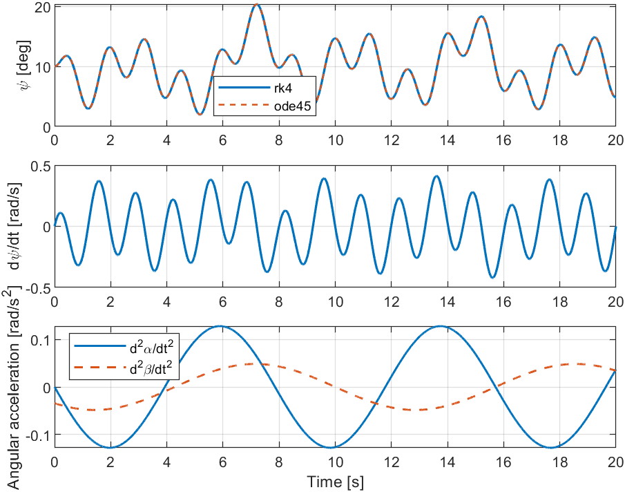
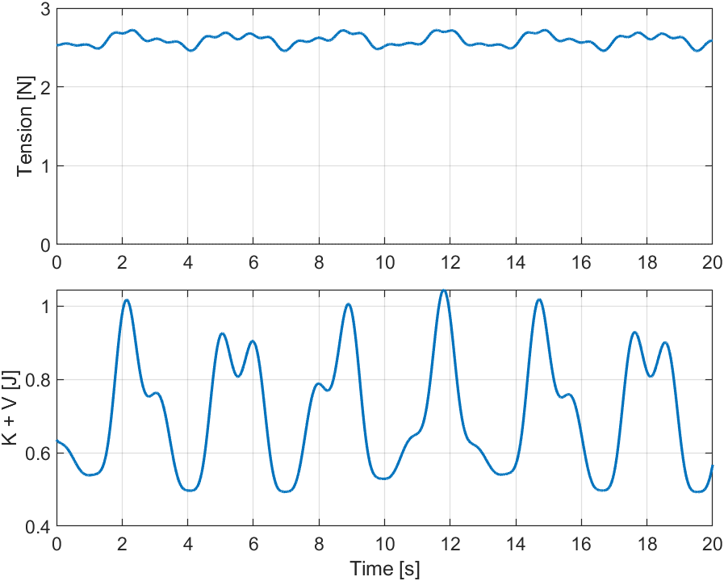
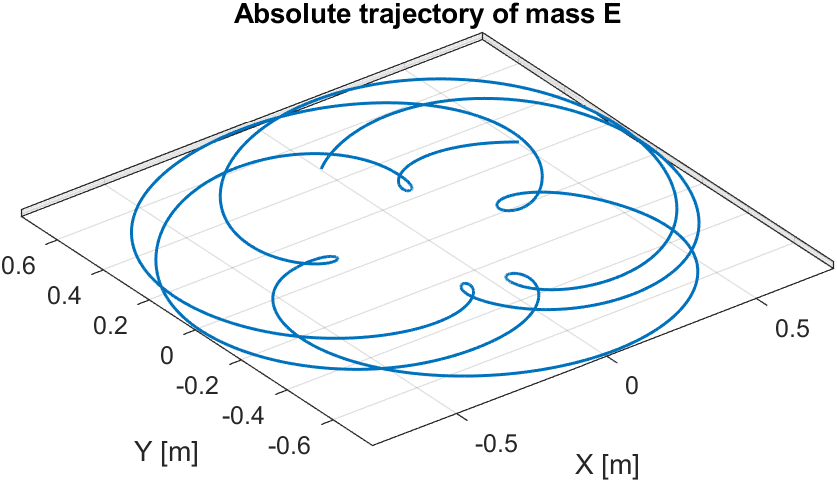
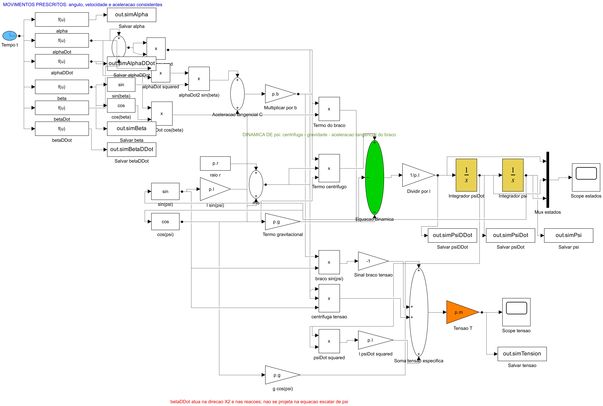
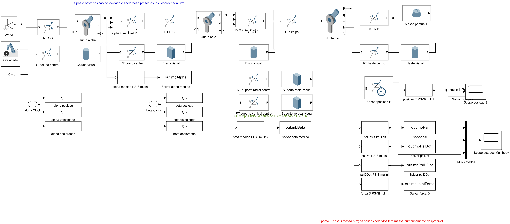
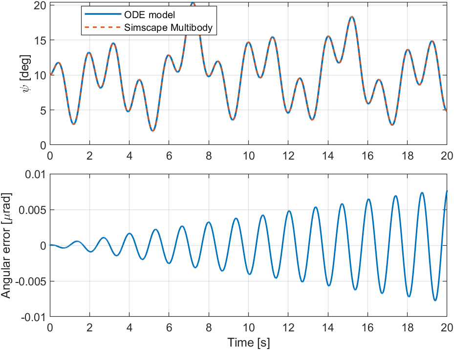

# Pêndulo em disco rotativo

Projeto de dinâmica não linear desenvolvido a partir de um exercício com três
rotações consecutivas. O caso original, com velocidades angulares constantes,
é usado como verificação. O modelo principal aceita movimentos prescritos
acelerados para o braço e para o disco e compara três implementações: MATLAB,
Simulink e Simscape Multibody.

## Equação de movimento

Com

```text
Omega = alphaDot + betaDot
rho   = r + l*sin(psi)
A_C   = b*(alphaDot^2*sin(beta) + alphaDDot*cos(beta))
```

a coordenada livre `psi` obedece a

```text
l*psiDDot + g*sin(psi) + A_C*cos(psi) - Omega^2*rho*cos(psi) = 0.
```

`alpha(t)` e `beta(t)` são entradas prescritas. A aceleração `alphaDDot` entra
diretamente na EDO por meio da aceleração tangencial do braço. `betaDDot` atua
na aceleração transversal e nas reações da junta, mas não se projeta na equação
escalar de `psi` para esta geometria.

Quando `alphaDDot = betaDDot = 0`, recupera-se o resultado do exercício usado
como referência.

## Resultados



| Grandezas físicas | Trajetória absoluta da massa |
|---|---|
|  |  |

## MATLAB

A pasta `matlab/+rotpend` reúne a lei de movimento, a EDO, a cinemática e o
pós-processamento. `matlab/+numerics/rk4.m` contém um RK4 clássico independente
do problema.

```matlab
cd('C:\Users\E\Documents\1 - Unicamp\7 - Projetos\pendulo-disco-rotativo')
addpath('matlab')
run('matlab/run_simulation.m')
results = run_all_tests();
```

O caso demonstrativo usa perfis suaves compostos por rotação média e modulação
harmônica. Para outra trajetória, atribua a `p.motionFunction` uma função que
retorne

```matlab
[alpha; alphaDot; alphaDDot; beta; betaDot; betaDDot]
```

no instante solicitado.

## Simulink



O modelo `matlab/simulink/rotating_pendulum.slx` mantém visíveis os seis sinais
de movimento prescrito, os termos da EDO, os dois integradores e o cálculo da
tração.

```matlab
addpath('matlab/simulink')
open_simulink_model
report = validate_simulink_model()
fixedReport = validate_simulink_fixed_step()
```

O arquivo pode ser reconstruído com `build_simulink_model(false)`. Consulte
[docs/SIMULINK.md](docs/SIMULINK.md) para a leitura do diagrama e a substituição
das entradas prescritas.

## Simscape Multibody



O modelo `matlab/multibody/rotating_pendulum_multibody.slx` representa corpos,
referenciais, juntas, atuadores, gravidade e sensores. Posição, velocidade e
aceleração são impostas de forma consistente nas juntas `alpha` e `beta`; `psi`
é uma coordenada livre.

```matlab
addpath('matlab/multibody')
open_multibody_model
reportMultibody = validate_multibody_model()
```



O procedimento e a preparação para CAD estão descritos em
[docs/MULTIBODY.md](docs/MULTIBODY.md).

### CAD do SolidWorks validado

A montagem corrigida está em `estrutura cad/corrected-solidworks`. A exportação
final do Simscape Multibody Link foi verificada no MATLAB e produz exatamente
três juntas revolutas (`alpha`, `beta` e `psi`), sem substituições rígidas ou
juntas cilíndricas.

```matlab
addpath('matlab/multibody')
result = import_cad_model(Overwrite=true, ...
    ModelName="rotating_pendulum_cad_final");
open_system(result.modelFile)
```

O modelo gerado fica em
`matlab/multibody/cad_import_final/rotating_pendulum_cad_final.slx`. Consulte
`estrutura cad/CAD_REVIEW.md` para a topologia, os nomes dos posicionamentos e
o procedimento de reexportação.

## Geometria

| Trecho | Definição |
|---|---|
| `O-A` | altura `a` |
| `A-B` | braço de comprimento `b` |
| `B-C` | altura `c` |
| `C-D` | vetor `[0, r, h]` em `B2` |
| `D-E` | haste de comprimento `l` |

`r` é radial e `h` é vertical. Portanto, `z_D = a + c + h`. Os deslocamentos
`a`, `c` e `h` alteram a posição absoluta, mas não entram na EDO ideal.

## Estrutura do repositório

```text
pendulo-disco-rotativo/
├── matlab/
│   ├── +numerics/             # RK4 genérico
│   ├── +post/                 # gráficos
│   ├── +rotpend/              # movimento, dinâmica e cinemática
│   ├── simulink/              # modelo por equações
│   ├── multibody/             # modelo físico 3D
│   └── tests/                 # testes automatizados
├── docs/                      # guias e figuras
├── report/
│   ├── rotating-disk-pendulum-dynamics.tex # relatório técnico
│   └── example-10-worked-solution.pdf
└── results/                   # saídas locais ignoradas pelo Git
```

## Relatório

O arquivo `report/rotating-disk-pendulum-dynamics.tex` contém a derivação completa e pode ser compilado no
Overleaf ou localmente com TeX Live/MiKTeX:

```text
cd report
latexmk -pdf rotating-disk-pendulum-dynamics.tex
```

Os valores de `defaultParameters.m` são demonstrativos. Dados extraídos do CAD
ou medidos nos atuadores devem substituí-los antes de qualquer comparação com
um equipamento real.